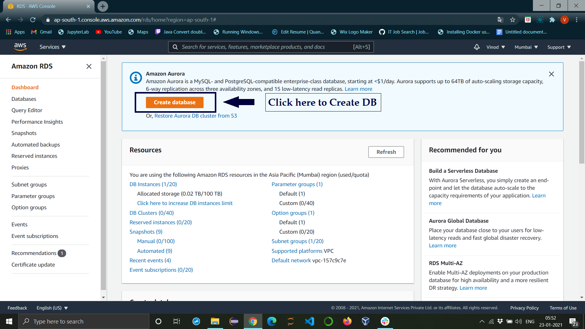
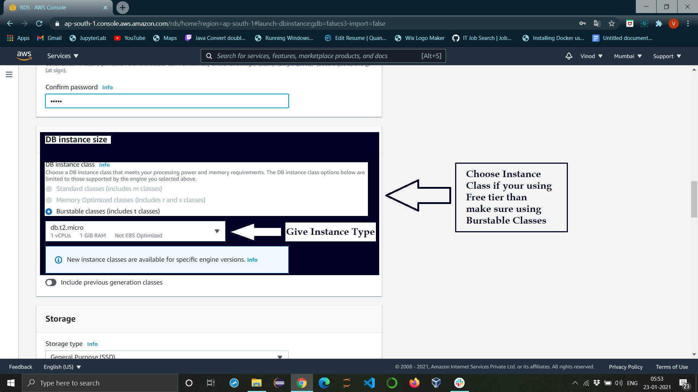
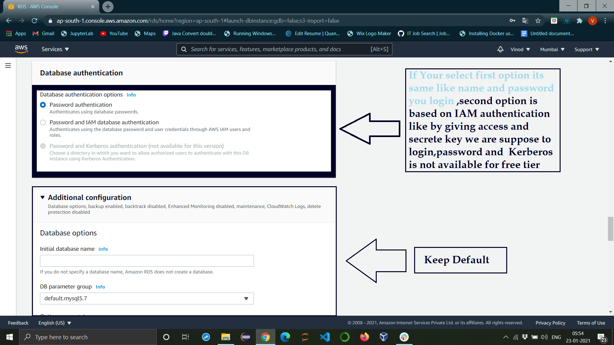
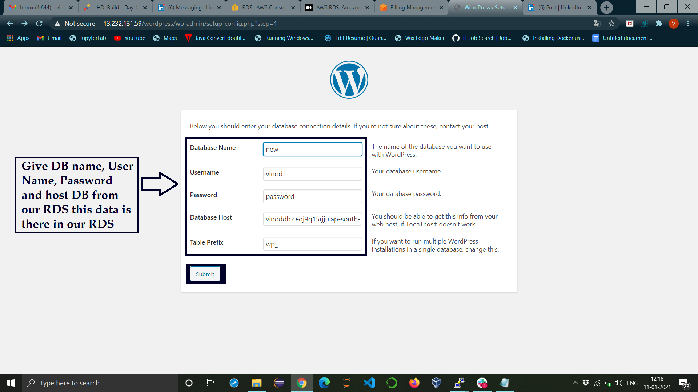

# Integrating Amazon RDS With WordPress

Inthis blog, I am going to integrate WordPress with Amazon RDS. It provides cost-efficient and resizable capacity while automating time-consuming administration tasks such as hardware provisioning, database setup, patching, and backups. It frees you to focus on your applications so you can give them the fast performance, high availability, security, and compatibility they need.

## What is DataBase :

A database is an organized collection of data so that it can be easily accessed and managed. You can organize data into tables, rows, columns, and index it to make it easier to find relevant information. Database handlers create a database in such a way that only one set of software programs provides access to data to all the users.

## Amazon RDS

Relational Database Service is a distributed relational database service by Amazon Web Services. It is a web service running “in the cloud” designed to simplify the setup, operation, and scaling of a relational database for use in applications.
This helps us to create a complete Database setup easy and maintenance automatically.

## WordPress

WordPress is a free and open-source content management system (CMS) written in PHP and paired with a MySQL or MariaDB database and web publishing software you can use to create a beautiful website or blog. Let’s start.

## Requirements:
AWS cloud account
## Follow these steps:

Create EC2 Instance with Redhat Linux or with any Linux image
Download and extract WordPress to a /var/www/html/
Create Amazon RDS
At last, create a WordPress account and Install

<b>Let’s dev into a practical,</b>

## 1. Create EC2 Instance:
Click [here](https://vinodhakumara2681997.medium.com/create-aws-ec2-instance-linux-2cefb48570df) to create EC2

## 2. Download and extract WordPress to a /var/www/html/

**STEP 1: Download Wordpress**
`wget https://wordpress.org/latest.tar.gz`
**Step 2: Install required software**

**Step 3: Extract WordPress to a /var/www/html/ folder**

**After extracting**

## 3. Create Amazon RDS
Follow the below steps to create RDS
**Start to create RDS**

**Select DB Method and Engine**

**Choose an appropriate DB version that supports your WordPress Version**

**Give DB name, User name, and password and note down those we are going to use later**

**Choose Instance type for RDS**

**Now we are ready to go Just click on Create database and create RDA**

**RDS is created**

**Login to MYSQL with username and password and hostname which is available in RDS new DB**

**Showing our DB**

**4. At last, create a WordPress account and Install**

>Thanks for reading :)